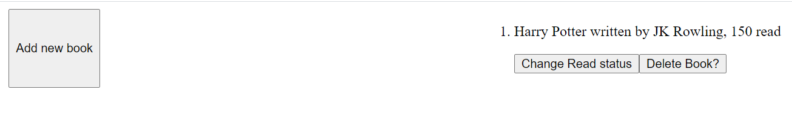
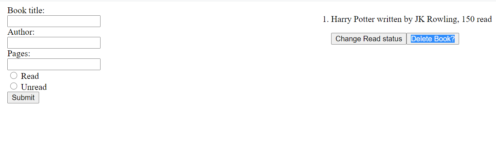

# Library in JavaScript
A simple book library implemented in JavaScript

> This is an assigment for Microverse JavaScript course. The goal is to make a book library with basic functionability.

Additional description about the project and its features.

## Built With

- HTML,
- CSS,
- JavaScript,
- Visual Studio Code

## Live Demo

[Live Demo](https://rawcdn.githack.com/NiiazalyDzhumaliev/library-js/f1fca53bffaef22f51270a71d5d453d13cf8ddfc/index.html)

## Getting Started

To get a local copy up and running follow these simple example steps.

### Prerequisites

- A compatible browser with HTML, CSS and JavaScript. 

### Install

- Just clone the project

### Usage

- Open the index.html file in any browser or edit using Visual Code or the preference IDE for web development

## Authors

👤 **Paul Ogolla**

- Github: [@paulzay](https://github.com/paulzay)
- Twitter: [@paulzay](https://twitter.com/_paulzay_)
- Linkedin: [@paulzay](https://linkedin.com/in/paulogolla)

👤 **Niiazaly Dzhumaliev**

- Github: [@NiiazalyDzhumaliev](https://github.com/NiiazalyDzhumaliev)
- Twitter: [@Niiazaly1](https://twitter.com/Niiazaly1)
- Linkedin: [@niiazaly-dzhumaliev](https://www.linkedin.com/in/niiazaly-dzhumaliev/)

## 🤝 Contributing

Contributions, issues and feature requests are welcome!

Feel free to check the [issues page](https://github.com/NiiazalyDzhumaliev/library-js/issues)

## Show your support

Give a ⭐️ if you like this project!

## Acknowledgments

- The Odin Project

## 📝 License

This project is free to use as learning purposes. For any external content (e.g. logo, images, ...), please contact the proper author and check their license of use.
